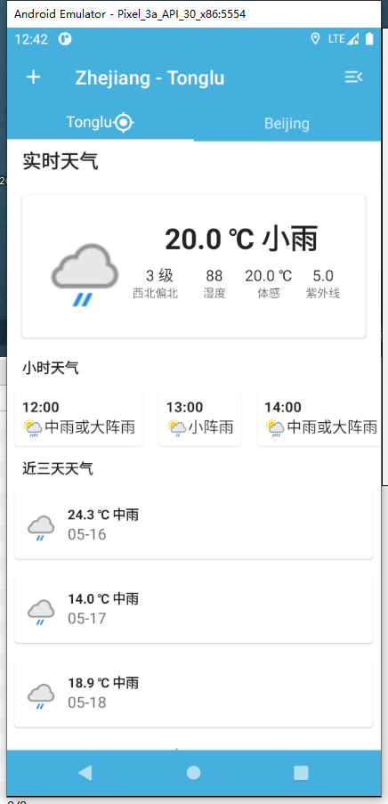
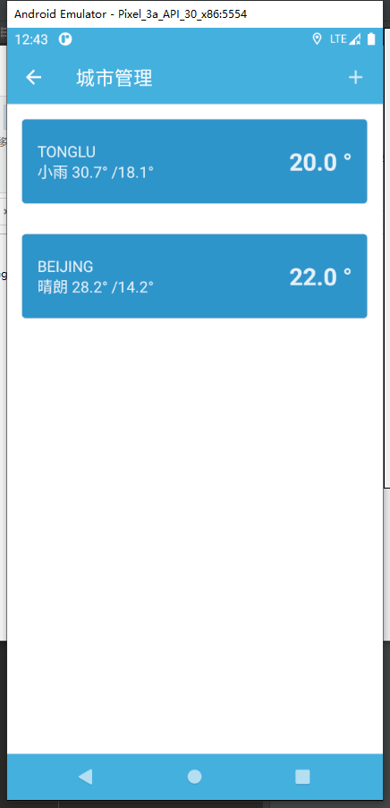
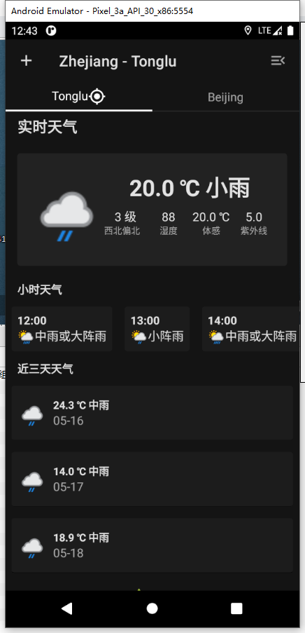

# ComposeWeather
 基于 Jetpack Compose 的天气应用

## 技术栈
* Jetpack Compose
* MVVM架构
* 协程
* Retrofit

## 功能
* 查看本地天气详细信息 (基于GPS定位)
* 支持同时查看多个地区天气

## 如何使用
1. 使用 AndroidStudio Canary 克隆本项目到本地
2. 修改 `util` 包下 `HttpClientBuilder` 中的 `API_KEY` 为你自己的API KEY (前往 [weatherapi.com](https://weatherapi.com) 申请)
3. 构建并运行

## 截图
| 首页 | 地区编辑页面 | 暗色模式 |
| --- | --- | --- |
|  |  |  |

## TODO:
* 缓存天气数据
* 记住城市列表
